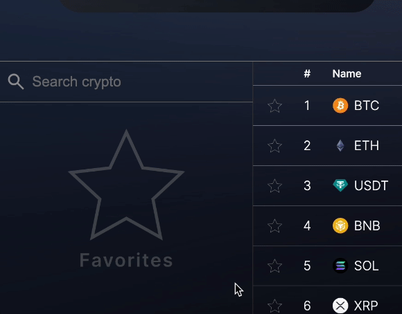

## What is BitCounter?

**Bitcounter** is a tool for monitoring the market of cryptocurrencies and tracking your investment portfolio!
It uses CoinGecko API for fetching crypto markets data. Also it uses TradingView LightWeight Chart API for showing asset price value changing.

## Features of Bitcounter's portfolio manager:

- With **BitCounter** you can find **any** asset and its values on cryptomarket

  

- Calculation of the average purchase price of an asset, taking into account the volume of purchase and the exchange rate at the time of the transaction
- The ability to add multiple portfolios to your account
- Integrated AI helper
- The ability to create a profile to which all your portfolio data will be linked. It allows you to use Bitcounter on many devices

## Project roadmap

- [x] ~~_Creating "Cryptocurrencies market" page_~~
- [ ] _Creating "Portfolio" page_
- [ ] _Creating "About" page_
